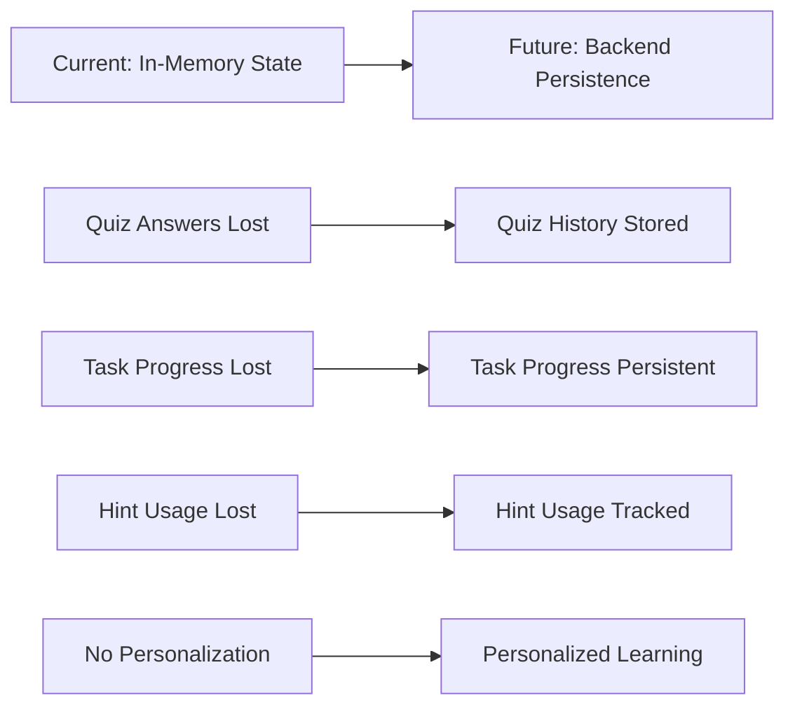
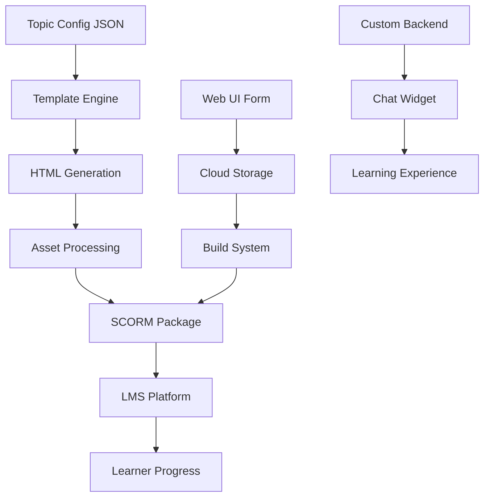

# SCORM Builder - System Overview and Documentation

## Project Overview

The SCORM Builder is a comprehensive system for creating interactive SCORM 2004 compliant learning packages. It combines a template-based content generation system with web-based authoring tools, cloud storage integration, and an AI-powered chat assistant to deliver engaging, stateful learning experiences.

## Quick Start

```bash
# Install dependencies
npm install

# Start web UI for form-based topic creation
npm run start:ui

# Build specific topic
npm run build:topic -- --topic=Robotics-M1-T1.1

# Build all topics
npm run build:all

# Test topic locally
npm run test:topic -- --topic=Robotics-M1-T1.1
```

## Architecture Overview

```
┌─────────────────────────────────────────────────────────────────┐
│                    SCORM Builder Ecosystem                     │
├─────────────────────────────────────────────────────────────────┤
│                                                                 │
│  ┌─────────────┐    ┌──────────────┐    ┌─────────────────┐     │
│  │   Web UI    │────│ Build System │────│   SCORM Package │     │
│  │             │    │              │    │                 │     │
│  │ • Forms     │    │ • Templates   │    │ • SCORM 2004    │     │
│  │ • Uploads   │    │ • Assets      │    │ • Interactive   │     │
│  │ • Preview   │    │ • Manifest    │    │ • Standalone    │     │
│  └─────────────┘    └──────────────┘    └─────────────────┘     │
│                                                                 │
│  ┌─────────────┐    ┌──────────────┐    ┌─────────────────┐     │
│  │ Cloud Store │────│ Chat Backend │────│   LMS Platform  │     │
│  │             │    │              │    │                 │     │
│  │ • Firestore │    │ • AI Chat     │    │ • Progress      │     │
│  │ • GCS       │    │ • History     │    │ • Completion    │     │
│  │ • Sync      │    │ • Context     │    │ • Analytics     │     │
│  └─────────────┘    └──────────────┘    └─────────────────┘     │
│                                                                 │
└─────────────────────────────────────────────────────────────────┘
```

## Documentation Structure

### 📚 Context Documentation

This `context/` directory contains comprehensive documentation for each major system component:

| Document | Description | Key Components |
|----------|-------------|----------------|
| [01-template-system.md](./01-template-system.md) | Template architecture and data flow | Mustache rendering, data injection, responsive design |
| [02-build-system.md](./02-build-system.md) | Build process and SCORM packaging | CLI tools, asset processing, IMS manifest generation |
| [03-webui-system.md](./03-webui-system.md) | Web interface and form handling | Express server, image uploads, real-time validation |
| [04-cloud-integration.md](./04-cloud-integration.md) | Cloud services and data persistence | Firestore, Google Cloud Storage, backup/recovery |
| [05-chat-system.md](./05-chat-system.md) | Chat system and backend integration | AI tutoring, contextual help, conversation history |
| [06-quiz-task-system.md](./06-quiz-task-system.md) | Quiz and task implementation | Interactive assessments, progress tracking |
| [07-scorm-integration.md](./07-scorm-integration.md) | SCORM API and LMS integration | Learner identification, progress reporting |

## Core Features

### 🎯 Template-Based Content Generation
- **Dynamic HTML Templates**: Mustache-based rendering system
- **Multi-Section Layout**: Hero, concepts, tasks, quiz sections
- **Responsive Design**: Mobile-first approach with Tailwind CSS
- **Asset Management**: Automatic image processing and optimization
- **Interactive Components**: Carousels, modals, split-screen workspace

### 🌐 Web-Based Authoring
- **Intuitive Forms**: Drag-and-drop interface for content creation
- **Real-Time Preview**: Live preview of generated content
- **Image Upload**: Secure file handling with cloud storage
- **Auto-Save**: Automatic draft saving and recovery
- **Validation**: Comprehensive form validation and error handling

### ☁️ Cloud Integration
- **Firestore Database**: Topic metadata and configurations
- **Google Cloud Storage**: Image and media file storage
- **Sync Capabilities**: Multi-device synchronization
- **Backup/Recovery**: Automated backup systems
- **Analytics**: Usage tracking and insights

### 🤖 AI-Powered Chat System
- **Contextual Tutoring**: Topic-specific assistance
- **Conversation History**: Persistent chat sessions
- **Multi-Modal Support**: Text and voice interactions
- **Smart Suggestions**: Context-aware help recommendations
- **Backend Integration**: Custom PostgreSQL backend support

### 📊 Interactive Learning Components
- **Multi-Question Quizzes**: MCQ and checkbox question types
- **Step-by-Step Tasks**: Guided learning with hints
- **Progress Tracking**: Real-time progress visualization
- **Code Examples**: Syntax-highlighted code blocks
- **Image Carousels**: Multi-image content display

### 📦 SCORM Compliance
- **SCORM 2004 Standard**: Full compliance with LMS requirements
- **Learner Identification**: Automatic SCORM API integration
- **Progress Reporting**: Real-time progress updates
- **Completion Tracking**: Comprehensive status management
- **Standalone Mode**: Fallback operation outside LMS

## Current State and Future Enhancements

### ✅ Currently Implemented
- Template-based content generation
- Web UI for topic creation
- Cloud storage integration
- SCORM package generation
- Chat system with backend integration
- Interactive quizzes and tasks
- SCORM API integration

### 🔄 In Progress - Stateful Enhancement
The system is currently **stateless** - all progress resets on page refresh. We're implementing a **stateful learning progress system**:



#### Planned Stateful Features
1. **PostgreSQL Backend Integration**
   - Learner session management
   - Progress history tracking
   - Performance analytics

2. **Enhanced Quiz System**
   - Question-level persistence
   - Multiple attempt support
   - Detailed analytics

3. **Task Progress Persistence**
   - Step completion tracking
   - Hint usage analytics
   - Time spent metrics

4. **Personalization Engine**
   - Adaptive learning paths
   - Difficulty adjustment
   - Recommendation system

## System Components

### Frontend Components
```
templates/
├── topic-template.html      # Main SCORM template
├── scorm-api.js           # SCORM API integration
├── quiz-system.js         # Interactive quiz logic
├── task-system.js         # Task management
├── chat-integration.js    # Chat widget loader
├── chat-system.js         # Chat controller
└── core-functions.js      # Utility functions

web-ui/
├── server.js              # Express server
├── routes/
│   ├── form.js           # Form handling
│   ├── upload.js         # Image upload
│   └── build.js          # Build management
└── public/
    ├── js/
    │   ├── form-handler.js    # Frontend form logic
    │   └── image-upload.js    # Upload handling
    └── index.html          # Main UI
```

### Backend Services
```
services/
├── topic-service.js       # Cloud topic management
└── cloud-services.js      # Google Cloud integration

scripts/
├── generate-topic.js      # Template rendering
├── package-scorm.js       # SCORM packaging
├── create-manifest.js     # IMS manifest generation
└── validate-topics.js     # Configuration validation
```

### Data Flow



## Development Workflow

### 1. Content Creation
```bash
# Start Web UI
npm run start:ui

# Create topic through web interface
# Upload images and configure content
# Preview and test interactively
```

### 2. Build Process
```bash
# Build single topic
npm run build:topic -- --topic=YourTopic

# Build all topics
npm run build:all

# Production build
npm run build:prod -- --topic=YourTopic
```

### 3. Testing
```bash
# Test locally
npm run test:topic -- --topic=YourTopic

# Validate configurations
npm run validate

# Start test server
npm run serve:test
```

### 4. Deployment
```bash
# Upload to LMS
# Test SCORM compliance
# Monitor learner progress
```

## Configuration

### Environment Variables
```bash
# Backend Configuration
BACKEND_URL=https://your-api.com
CHAT_MODE=custom_backend

# Cloud Configuration
GOOGLE_CLOUD_PROJECT=your-project
GOOGLE_APPLICATION_CREDENTIALS=./service-account.json
GCS_BUCKET_NAME=your-storage-bucket
FIRESTORE_PROJECT_ID=your-project-id

# Build Configuration
NODE_ENV=production
OUTPUT_DIR=./dist
```

### Build Configuration
```javascript
// build.js options
{
    topic: 'topic-name',
    backendUrl: 'https://api.example.com',
    chatMode: 'custom_backend',
    prod: false,
    output: './dist',
    verbose: false
}
```

## API Integration

### Custom Backend API
```javascript
// Expected endpoints for stateful enhancement
POST /api/sessions              # Create learning session
GET /api/sessions/:topicId/:learnerId  # Load progress
PUT /api/task-progress/:sessionId     # Update task completion
POST /api/hint-usage/:sessionId      # Record hint usage
POST /api/quiz-attempts/:sessionId   # Submit quiz answers
GET /api/quiz-attempts/:sessionId/latest  # Get latest quiz state
```

### Chat Backend API
```javascript
// Current chat backend endpoints
POST /api/chat/session         # Initialize chat
POST /api/chat/message         # Send message
PUT /api/chat/context          # Update context
GET /api/chat/history/:sessionId    # Load history
POST /api/chat/history         # Save history
```

## Data Models

### Topic Configuration
```json
{
    "title": "Topic Title",
    "description": "Topic description",
    "learning_objectives": ["Objective 1", "Objective 2"],
    "content": {
        "task_statement": "Main task",
        "task_steps": [...],
        "concepts": [...],
        "hero_image": {...}
    },
    "quiz": {
        "title": "Quiz Title",
        "questions": [...],
        "settings": {...}
    },
    "chat_contexts": {
        "task_help": "Context for task assistance",
        "concept_name": "Context for specific concept"
    }
}
```

### Learner Progress (Future)
```json
{
    "sessionId": "session_123",
    "learnerId": "user_456",
    "topicId": "robotics-fundamentals",
    "taskProgress": {
        "completedSteps": [0, 1, 3],
        "revealedHints": [...],
        "timeSpent": 3600
    },
    "quizAttempts": [...],
    "createdAt": "2024-01-15T10:00:00Z",
    "updatedAt": "2024-01-15T11:30:00Z"
}
```

## Best Practices

### Content Creation
1. **Clear Learning Objectives**: Define measurable outcomes
2. **Progressive Difficulty**: Structure content logically
3. **Interactive Elements**: Use varied content types
4. **Accessibility**: Provide alt text and captions
5. **Mobile Optimization**: Test on various devices

### Technical Implementation
1. **Error Handling**: Comprehensive error management
2. **Performance**: Optimize images and code
3. **Security**: Validate inputs and sanitize data
4. **Scalability**: Design for concurrent users
5. **Maintainability**: Document code and use consistent patterns

### SCORM Compliance
1. **Data Model Elements**: Use correct SCORM data elements
2. **Error Handling**: Handle API failures gracefully
3. **Standalone Mode**: Provide fallback functionality
4. **Progress Tracking**: Update status appropriately
5. **Termination**: Clean up resources properly

## Troubleshooting

### Common Issues
1. **Build Failures**: Check JSON syntax and missing assets
2. **SCORM Errors**: Verify LMS configuration and API calls
3. **Chat Issues**: Check backend connectivity and CORS settings
4. **Upload Problems**: Verify file size limits and permissions
5. **Display Issues**: Check responsive design and browser compatibility

### Debug Information
```javascript
// Check system status
console.log('Template Data:', window.templateData);
console.log('Learner Data:', window.learnerData);
console.log('SCORM API:', !!window.scormAPI);
console.log('Chat Widget:', !!window.chatWidget);
```

### Log Analysis
```bash
# Enable verbose logging
npm run build:topic -- --topic=YourTopic --verbose

# Check build logs
tail -f logs/build.log

# Monitor SCORM communication
console.log('SCORM Debug:', getSCORMDebugInfo());
```

## Contributing

### Development Setup
```bash
# Clone repository
git clone <repository-url>
cd scorm-builder

# Install dependencies
npm install

# Start development server
npm run dev:ui

# Run tests
npm test

# Lint code
npm run lint
```

### Code Standards
- Use ESLint for code quality
- Follow JavaScript ES6+ standards
- Document functions and classes
- Test new features thoroughly
- Update documentation for changes

## Support and Resources

### Documentation
- [API Reference](./docs/api.md)
- [Configuration Guide](./docs/configuration.md)
- [Deployment Guide](./docs/deployment.md)
- [Troubleshooting Guide](./docs/troubleshooting.md)

### Community
- GitHub Issues: Report bugs and request features
- Documentation Wiki: Community contributions
- Example Topics: Sample configurations

### Contact
- Technical Support: support@example.com
- Documentation: docs@example.com
- Feature Requests: features@example.com

---

## Quick Reference

### Essential Commands
```bash
npm start                    # Start web UI
npm run build:topic          # Build single topic
npm run build:all           # Build all topics
npm run validate            # Validate topics
npm run test:topic          # Test topic locally
npm run serve:test          # Start test server
```

### Key Files
- `build.js` - Main build orchestrator
- `templates/topic-template.html` - Main template
- `web-ui/server.js` - Web UI server
- `services/topic-service.js` - Cloud integration
- `templates/quiz-system.js` - Quiz functionality
- `templates/scorm-api.js` - SCORM integration

### Configuration
- Environment variables in `.env`
- Build configuration in `build.js`
- Template data in topic JSON files
- Cloud credentials in service account file

This comprehensive documentation provides everything needed to understand, develop, deploy, and maintain the SCORM Builder system. Each component is thoroughly documented in its respective file within this context directory.